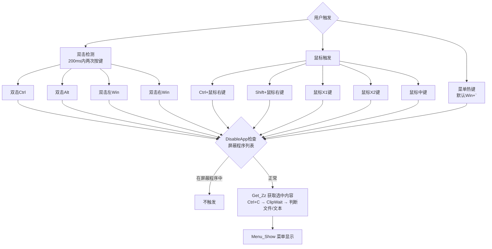
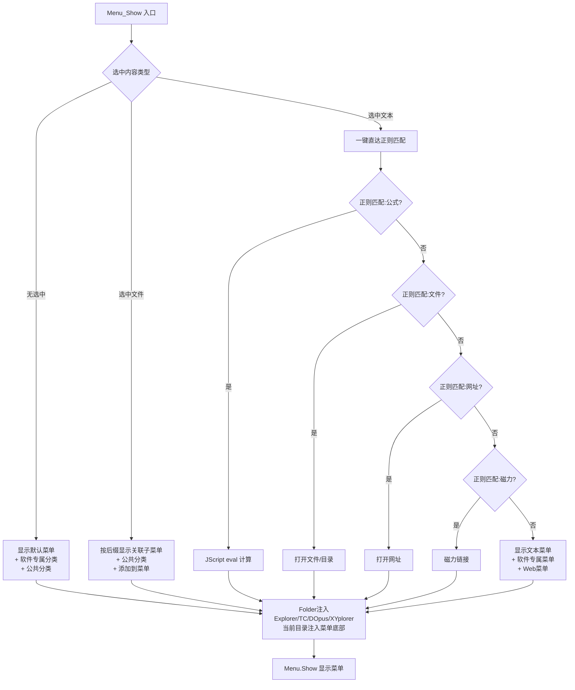
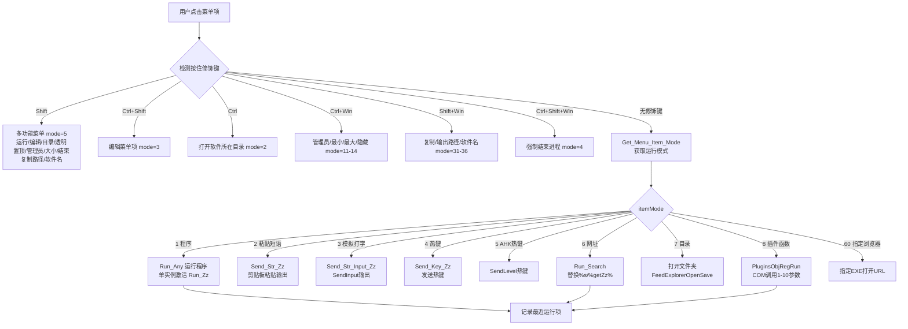
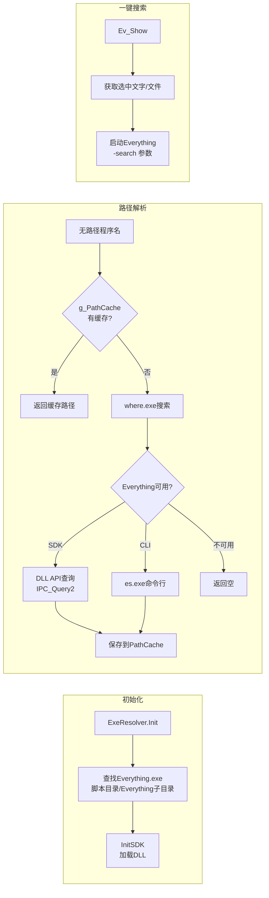
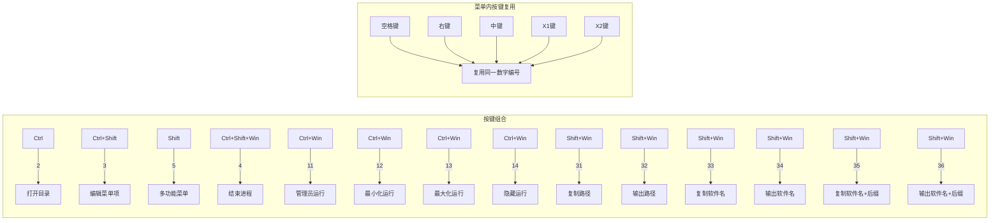
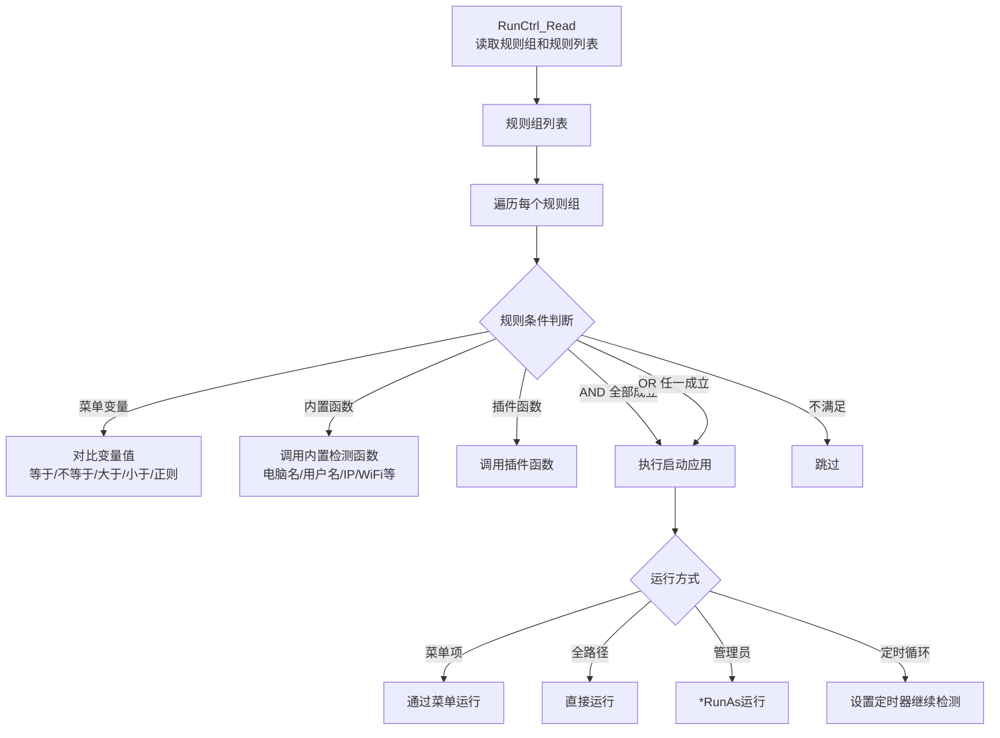

# RunAny V1 功能流程图 & V1/V2 对比

## 一、V1 启动初始化流程

```mermaid
flowchart TD
    START([RunAny.ahk 启动]) --> GLOBAL[全局变量定义<br/>名称/版本/路径/插件目录]
    GLOBAL --> CONFIG[01. 配置初始化 Config_Set<br/>读取RunAnyConfig.ini]
    CONFIG --> MENUVAR[02. 自定义变量 Menu_Var_Set<br/>解析系统变量/环境变量/用户变量]
    MENUVAR --> ICON[03. 图标初始化 Icon_Set<br/>图标路径/尺寸配置]
    ICON --> ENV[04. 运行环境检测 Run_Exist<br/>INI存在性/Everything DLL/编码]
    ENV --> HOTKEY[05. 热键注册<br/>遍历HotKeyList动态注册<br/>IfWinNotActive DisableGUI]
    HOTKEY --> TRAY[06. 托盘菜单构建 Menu_Tray_Add]
    TRAY --> EXTICON[07. 后缀图标初始化<br/>扫描ExeIcon/WebIcon/MenuIcon目录]
    EXTICON --> PLUGIN[08. 插件读取 Plugins_Read<br/>扫描RunPlugins目录]
    PLUGIN --> PLUGINAUTO[09. 自动启动插件 AutoRun_Plugins]
    PLUGINAUTO --> PLUGINCOM[10. COM对象注册 Plugins_Object_Register]
    PLUGINCOM --> RUNCTRL[11. 启动规则读取 RunCtrl_Read]
    RUNCTRL --> MENUBUILD[13-16. 菜单创建<br/>解析INI → Menu_Read]
    MENUBUILD --> EVSEARCH[17. Everything搜索无路径应用<br/>按需/全磁盘模式]
    EVSEARCH --> FILTER[19. 菜单过滤<br/>隐藏失效项/短语/网址等]
    FILTER --> OPENSEXT[21. 内部关联后缀 Open_Ext_Set]
    OPENSEXT --> EXEICON[22. EXE图标异步加载]
    EXEICON --> BACKUP[26. 自动备份 RunABackup]
    BACKUP --> AUTORELOAD[自动重载定时器<br/>检测INI修改时间]
    AUTORELOAD --> READY([RunAny 就绪])
```



## 二、V1 菜单触发系统



## 三、V1 菜单显示决策树



## 四、V1 菜单项执行系统



## 五、V1 Everything 集成流程



## 六、V1 HoldKey 数字映射系统



## 七、V1 插件系统

```mermaid
flowchart TD
    PLUGDIR[RunPlugins目录] --> SCAN[扫描.ahk文件]
    SCAN --> READ[读取元数据<br/>Name/Version/Icon]
    READ --> REG{注册COM对象}
    REG --> AUTORUN[自动启动标记为启用的插件]
    
    RUN[菜单项包含插件函数] --> PARSE[解析: 插件名[函数名]参数]
    PARSE --> COM[PluginsObjRegRun<br/>COM调用 1-10参数]
    
    subgraph 内置插件
        HUIZZ[huiZz_Text<br/>短语加解密<br/>URI编解码<br/>Unicode转换]
        MENU[RunAny_Menu<br/>Space/右键/中键行为<br/>XButton行为]
        SYSTEM[huiZz_System<br/>系统工具函数]
        WINDOW[huiZz_Window<br/>窗口管理函数]
    end
```

## 八、V1 启动规则系统



---

## 九、V1 vs V2 功能对比表

### 核心菜单系统
| 功能 | V1 | V2 | 状态 |
|------|----|----|------|
| INI菜单解析 | Menu_Read L607 | MenuParser.ahk | ✅ 完整 |
| 菜单构建(默认/文本/文件) | Menu_Show L1162 | MenuBuilder.ahk | ✅ 完整 |
| 窗口感知菜单 | windowCategories | MenuBuilder.windowCategories | ✅ 完整 |
| 扩展名映射 | extMap | MenuBuilder.extMap | ✅ 完整 |
| Folder注入(Explorer/TC/DOpus/XYplorer) | L1480-1630 | FolderInjector.ahk | ✅ 完整 |
| 对话框路径导航 | FeedExplorerOpenSave | FolderHelper.NavigateTo | ✅ 完整 |
| 图标异步加载 | MenuExeIconArray | IconLoader | ✅ 完整 |
| 批量搜索 | Web_Search L2335 | MenuBuilder | ✅ 完整 |
| 添加文件到菜单 | Menu_Tray_Show L1119 | MenuBuilder | ✅ 完整 |

### 菜单触发
| 功能 | V1 | V2 | 状态 |
|------|----|----|------|
| 双击Ctrl/Alt/Win | DoubleClickKey L595 | DoubleTap.ahk | ✅ 完整 |
| Ctrl/Shift+鼠标右键 | L579-583 | DoubleTap.ahk | ✅ 完整 |
| XButton1/XButton2/中键 | L585-592 | DoubleTap.ahk | ✅ 完整 |
| 屏蔽程序DisableApp | GroupAdd DisableGUI L3357 | Hotkeys.ahk + DoubleTap | ✅ 完整 |
| 菜单热键(默认Win+`) | HotKeyList L37 | RegisterConfigHotkeys | ✅ 完整 |

### 菜单项执行
| 功能 | V1 | V2 | 状态 |
|------|----|----|------|
| 程序运行+单实例激活 | Run_Any / Run_Zz | Launcher.RunOrActivate | ✅ 完整 |
| 粘贴短语/模拟打字 | Send_Str_Zz / Send_Str_Input_Zz | Launcher.RunPhrase/RunTypingPhrase | ✅ 完整 |
| 热键发送 | Send_Key_Zz | Launcher.RunHotkey | ✅ 完整 |
| URL搜索(%s/%getZz%) | Run_Search L2305 | Launcher.RunURL | ✅ 完整 |
| 插件COM调用 | PluginsObjRegRun | Launcher.RunPlugin | ✅ 完整 |
| 指定浏览器打开 | mode=60 | Launcher.RunExeUrl | ✅ 完整 |
| 透明度/置顶运行 | Run_Wait L2110 | Launcher.RunProgram | ✅ 完整 |
| 管理员/最小/最大/隐藏 | MenuRunWay L1793 | Launcher.RunProgram | ✅ 完整 |
| 最近运行项 | Menu_Recent L1700 | Recent.ahk | ✅ 完整 |

### HoldKey修饰键系统
| 功能 | V1 | V2 | 状态 |
|------|----|----|------|
| Ctrl=打开目录(2) | HoldCtrlRun=2 | Launcher HoldCtrl=2 | ✅ 完整 |
| Shift=多功能菜单(5) | HoldShiftRun=5 | MultiMenu.ahk | ✅ 完整 |
| Ctrl+Shift=编辑(3) | HoldCtrlShiftRun=3 | Launcher | ✅ 完整 |
| Ctrl+Win=管理员(11-14) | HoldCtrlWinRun=11 | Launcher | ✅ 完整 |
| Shift+Win=复制路径(31-36) | HoldShiftWinRun=31 | Launcher | ✅ 完整 |
| Ctrl+Shift+Win=结束(4) | HoldCtrlShiftWinRun=4 | Launcher | ✅ 完整 |
| Space/右键/中键复用编号 | RunAny_Menu插件 | ❌ 未实现 | ⚠️ 缺失 |
| 多功能运行菜单 | MenuRunMultifunctionMenu L1857 | MultiMenu.ahk | ✅ 完整 |

### Everything集成
| 功能 | V1 | V2 | 状态 |
|------|----|----|------|
| Everything SDK DLL调用 | class everything L4712 | EverythingSDK in ExeResolver | ✅ 完整 |
| es.exe CLI后备查询 | - | ExeResolver | ✅ 完整 |
| 按需/全磁盘搜索模式 | EvDemandSearch | SettingsGui Tab5 | ✅ 完整 |
| 路径持久缓存 | MenuObjCache | PathCache.ahk | ✅ 完整 |
| 一键Everything搜索 | Ev_Show L2361 | EverythingSearch.Show | ✅ 完整 |
| 管理员权限同步 | EverythingIsRun L4634 | ExeResolver | ⚠️ 部分 |
| 重建索引 | SetEvReindex | SettingsGui.EvReindex | ✅ 完整 |

### 一键直达
| 功能 | V1 | V2 | 状态 |
|------|----|----|------|
| 正则匹配执行 | L1310-1389 | OneKey.ahk | ✅ 完整 |
| 一键公式计算 | JScript eval | OneKey.ahk JScript | ✅ 完整 |
| 一键打开文件/目录/网址 | 内置5种规则 | OneKey.ahk | ✅ 完整 |
| 一键搜索(多搜索引擎) | One_Search L2292 | RunAny_v2.ahk | ✅ 完整 |
| JumpSearch跳过确认 | JumpSearch L3456 | ⚠️ 配置项有,逻辑未实现 | ⚠️ 部分 |

### 热字符串系统
| 功能 | V1 | V2 | 状态 |
|------|----|----|------|
| 热字符串注册(X/非X模式) | L805-829 | Hotkeys.ahk | ✅ 完整 |
| 热字符串提示 | Menu_HotStr_Hint L932 | HotStrHint.ahk | ✅ 完整 |
| 提示长度/时间/透明度/坐标 | 配置项 | SettingsGui Tab8 | ✅ 完整 |

### 插件系统
| 功能 | V1 | V2 | 状态 |
|------|----|----|------|
| 插件扫描/元数据读取 | Plugins_Read L3842 | PluginManager.ahk | ✅ 完整 |
| COM对象注册 | Plugins_Object_Register | PluginManager | ✅ 完整 |
| 自动启动/停止 | AutoRun/AutoClose_Plugins | PluginManager | ✅ 完整 |
| 插件管理GUI | Plugins_Gui | PluginManager PluginGui | ✅ 完整 |
| 独立插件暂停/挂起/关闭 | 热键 L41 | SettingsGui Tab2 | ✅ 配置项有 |

### 设置GUI
| 功能 | V1 | V2 | 状态 |
|------|----|----|------|
| Tab1 RunAny设置 | L8364-8406 | SettingsGui BuildTab1 | ✅ 完整 |
| Tab2 热键配置(19项) | L8407-8442 | SettingsGui BuildTab2 | ✅ 完整 |
| Tab3 菜单变量(预填充) | L8444-8467 | SettingsGui BuildTab3 | ✅ 完整 |
| Tab4 无路径缓存 | L8476-8510 | SettingsGui BuildTab4 | ✅ 完整 |
| Tab5 搜索Everything | L8512-8543 | SettingsGui BuildTab5 | ✅ 完整 |
| Tab6 一键直达 | L8545-8577 | SettingsGui BuildTab6 | ✅ 完整 |
| Tab7 内部关联 | L8579-8598 | SettingsGui BuildTab7 | ✅ 完整 |
| Tab8 热字符串 | L8600-8619 | SettingsGui BuildTab8 | ✅ 完整 |
| Tab9 图标设置 | L8621-8647 | SettingsGui BuildTab9 | ✅ 完整 |
| Tab10 高级配置(26项) | L8649-8696 | SettingsGui BuildTab10 | ✅ 完整 |

### 启动规则
| 功能 | V1 | V2 | 状态 |
|------|----|----|------|
| 规则组/规则读取 | RunCtrl_Read L4043 | RunCtrl.ahk | ✅ 完整 |
| 条件判断(AND/OR) | Rule_Effect L4197 | RunCtrlEngine | ✅ 完整 |
| 运行方式(置顶/最小/最大/隐藏) | RunCtrl_RunApps L4261 | RunCtrlEngine | ✅ 完整 |
| 启动管理GUI | RunCtrl_Manage_Gui | RunCtrlGui.ahk | ✅ 完整 |

### 其他系统
| 功能 | V1 | V2 | 状态 |
|------|----|----|------|
| 自动备份 | RunABackup L511 | RunAny_v2.ahk DoBackup | ✅ 完整 |
| INI自动重载 | AutoReloadMTime L496 | RunAny_v2.ahk | ✅ 完整 |
| 托盘菜单(14项) | L4550-4630 | SetupTrayMenu | ✅ 完整 |
| 菜单树编辑器 | L5323-5700 | MenuEditor.ahk | ✅ 完整 |
| 选中内容获取(Get_Zz) | L2458-2481 | GetSelectedText | ✅ 完整 |
| 特殊应用复制键适配 | GetZzCopyKeyApp L2464 | GetSelectedText | ✅ 完整 |
| 双菜单系统 | iniPath2 / MENU2FLAG | MultiMenu | ✅ 完整 |
| 检查更新 | Auto_Update L4436 | 占位"开发中" | ❌ 未实现 |
| 资源管理器快速切换 | CtrlGQuickSwitch L1485 | ❌ 未找到 | ❌ 缺失 |
| 菜单列表查看 | RunA_MenuObj_Show | ShowMenuList | ✅ 完整 |
| 外部调用接口 | Remote_Dyna_Run L3171 | ❌ 未实现 | ❌ 缺失 |

### 图标系统
| 功能 | V1 | V2 | 状态 |
|------|----|----|------|
| EXE自身图标提取 | Menu_Add L997 | IconLoader | ✅ 完整 |
| LNK快捷方式图标 | FileGetShortcut L1042 | IconLoader | ✅ 完整 |
| 注册表关联图标 | DefaultIcon L1058 | ❌ | ⚠️ 缺失 |
| 自定义ico文件 | IconFolderList L1087 | IconLoader | ✅ 完整 |
| Web图标(域名.ico) | RunIconDir L1014 | IconLoader | ✅ 完整 |
| EXE图标生成(ResourcesExtract) | Menu_Exe_Icon_Create L8644 | ❌ | ❌ 缺失 |

---

## 十、V2 需补全的关键功能（按优先级排序）

### P0 - 核心缺失
1. **Space/右键/中键/XButton 复用HoldKey编号** — V1的RunAny_Menu插件核心功能，菜单内按键执行HoldKey操作

### P1 - 重要功能
2. **JumpSearch 跳过批量搜索确认** — 配置项已有，运行逻辑未接入
3. **Everything管理员权限同步** — V1会自动以管理员重启Everything
4. **资源管理器快速切换(Ctrl+G)** — V1 L1485，在资源管理器中Ctrl+G弹出菜单切换当前目录

### P2 - 增强功能
5. **检查更新系统** — V1有完整的GitHub/Gitee自动更新
6. **注册表关联图标** — 未知后缀时从注册表查找默认图标
7. **EXE图标生成(ResourcesExtract)** — V1 Tab9中的批量图标提取
8. **外部调用接口** — Remote_Dyna_Run/Remote_Menu_Run

### P3 - 不复刻（用户指定排除）
- XiaoYao_plus 插件
- xiaoyao_防卡键 插件
